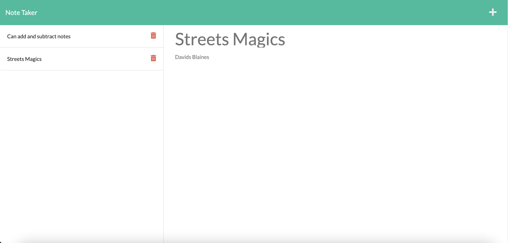

# note-taker

## Table of Contents:

-   [Description](./README.md#description)
-   [Installation](./README.md#installation)
-   [Usage](./README.md#usage)
-   [Contributing](./README.md#contributing)
-   [Screenshot](./README.md#screenshot)
-   [Links to Application](./README.md#links-to-application)
-   [Questions](./README.md#questions)

## Description

This is a note taking application. When a user runs the server.js file, it allows them to use the note taking functionality. A user is presented with a landing page with a link to the note taking page. When the user enters the note taking page, they are presented with a list of existing notes on the left side of the screen, and an empty field for adding new notes on the right side of the screen. When a user enters a new note's title and text content on the right, a save icon appears in the upper right hand corner. When the user clicks this save icon, the new note is saved to the notes database and will now appear on the left hand side with the previously existing notes. A user can click on any existing note on the left hand side to make it appear on the right hand side for easier viewing. The user may click the write icon in the upper right hand corner at any time to provide an empty note entry field for filling out. Additionally, each created note has a trash icon included with it on the left hand side. A user may click on this trash icon to delete the note from the database.

## Installation

If you wish to use this application, you will need to access my GitHub account (RedComet6) and copy the code.

## Usage

To use this application, obtain the code from my GitHub account (RedComet6), and run "node server.js" from the command line terminal.

## Contributing

If you wish to contribute to my content, please contact me at asunshine99@gmail.com.

## Screenshot

## Links to Application

-   Here is the deployed app on Heroku: [https://aidan-chamberlain-note-taker.herokuapp.com/](https://aidan-chamberlain-note-taker.herokuapp.com/)
-   Here is the demo video on Google Drive: [https://drive.google.com/file/d/1A3jNoUFuyS2EO6IaExFusug1V0hbQM1G/view?usp=sharing](https://drive.google.com/file/d/1A3jNoUFuyS2EO6IaExFusug1V0hbQM1G/view?usp=sharing)
-   Here is the repo: [https://github.com/RedComet6/note-taker](https://github.com/RedComet6/note-taker)
-   Here is the pages: [https://redcomet6.github.io/note-taker/](https://redcomet6.github.io/note-taker/)

## Questions

If you have any questions, you may contact:

#### Aidan Chamberlain

Email: asunshine99@gmail.com  
Github Profile: [https://www.github.com/RedComet6](https://www.github.com/RedComet6)
